  <i>"Embarrassment is an underexplored emotion. Go out there and make a fool out of yourself." - Austin B.</i>

 

<b></b>

### 🇪🇺 About me

- I'm Joseph. A developer, human and a daydreamer.
- I like tinkering with things. Making something better than it already is or create something new entirely from scratch.
- I enjoy new experiences. However simple or strange, if it's something unusual to see, it is worth exploring.

### 🇫🇷 À propos de moi

- Je m'appelle Joseph. Je suis un développeur, humain et un rêveur.
- J'aime bricoler, améliorer quelque chose ou créer quelque chose de complètement nouveau.
- J'aime les nouvelles expériences. Aussi simples ou étranges soient-elles, si c'est quelque chose d'inhabituel à voir, ça vaut la peine d'être exploré.
